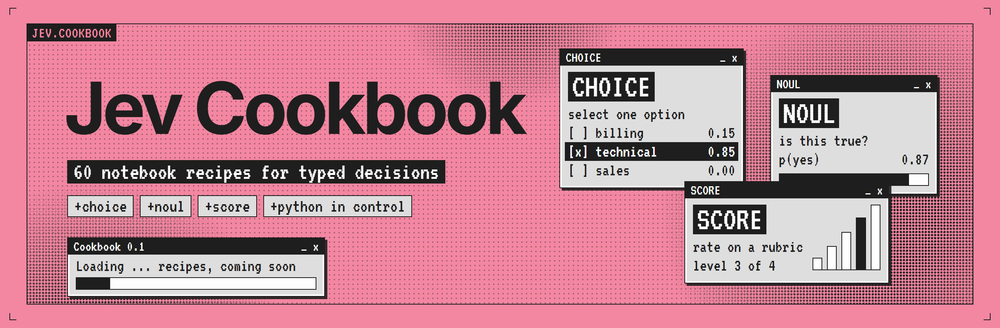
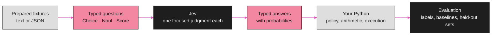

<p align="center">
  
</p>

<div align="center">

# Jev Cookbook

**Sixty notebook recipes for typed decisions with Jev, ordered from a first `Choice` question to closed-loop factory control.**

<!-- catalog:progress:start -->
   
<!-- catalog:progress:end -->
 [](LICENSE)

[How a recipe works](#how-a-recipe-works) · [Decision types](#decision-types) · [Levels](#difficulty-levels) · [Categories](#browse-by-category) · [Recipes](#the-recipes) · [Sources](#sources) · [Contributing](#contributing)

</div>

---

Jev is TypeSafe AI's System One model. It does not write text. You send it a **state** and a set of **typed questions**, and it returns structured answers your code can branch on, sort by, and route with. This cookbook is a curriculum of Jupyter notebooks that teach that way of building, one bounded decision at a time.

> [!NOTE]
> **Every recipe below is coming soon.** The catalog is final enough to plan against: 60 use cases, 10 categories, 5 difficulty levels. Notebooks land level by level, and each row links to the issue where its recipe is being built. Nothing here reports a measured Jev result yet.

## How a recipe works

Each notebook keeps the same division of labour. Jev supplies a narrow semantic judgment. Python does everything exact: arithmetic, retrieval, policy, permissions, and execution.



A question is a few lines of Python. This is the shape recipe 01 starts from, using the TypeSafe Python SDK:

```python
from typesafe_sdk import Choice, TypeSafeClient

with TypeSafeClient() as client:  # reads TYPESAFE_API_KEY
    response = client.system_one(
        state={"review": "Arrived fast, but the lid cracked within a week."},
        questions={
            "sentiment": Choice(
                instructions="What is the overall sentiment of this review?",
                criteria={"positive": None, "neutral": None, "negative": None, "mixed": None},
            ),
        },
    )

print(response.choices["sentiment"].choice)
```

What every recipe assumes:

| | |
| --- | --- |
| **You** | Know basic Python. No machine learning background is needed for levels 1 to 3. |
| **Data** | Prepared text or JSON fixtures that ship with the recipe. All of it is synthetic. |
| **Actions** | Simulated. No recipe sends a message, moves a file, or touches a real system. |
| **Model calls** | Offline by default, replaying fixtures. Live Jev calls are opt-in with your own key. |
| **Claims** | Fixture runs show that the pipeline works. Statements about quality, latency, or cost need measured inference on a held-out set, and a recipe says which one you are looking at. |

## Decision types

The catalog uses Jev's own vocabulary. Every recipe is tagged with the primitives it asks for.

| Type | Role | How to read it |
| --- | --- | --- |
| `Choice` | Select one option | Select one item from supplied alternatives, including none, other, or uncertain outcomes when the task needs them. Returns the choice, a probability per option, and a confidence. |
| `Noul` | Judge a proposition | Return the probability that a stated proposition holds. Tasks that allow several labels ask one independent question per label. There is no separate confidence field. |
| `Score` | Evaluate a rubric | Return a position and a distribution over ordered rubric levels you define. Exact measurements and arithmetic stay in code. |
| Combination | Compose judgments | Combine independent questions in Python, and make a later request when one judgment depends on an earlier answer. |

A single label can stand for several independent questions of that type. Thresholds are a property of the task, so each recipe that uses one chooses it from examples and evaluates it.

## Difficulty levels

Rank 1 is the easiest recipe and rank 60 the most demanding. Follow the ranks for a full learning sequence, or pick a category for a focused track.

<!-- catalog:levels:start -->
| Level | Name | What a notebook at this level involves | Recipes |
| :---: | --- | --- | :---: |
| **1** | [Beginner](#level-1--beginner) | One bounded judgment over a short prepared input with direct inspection of typed results. | 10<br><sub>01 to 10</sub> |
| **2** | [Easy](#level-2--easy) | Context-sensitive matching, scoring, or verification with candidate sets and explicit uncertain or no-match outcomes. | 13<br><sub>11 to 23</sub> |
| **3** | [Intermediate](#level-3--intermediate) | Multiple judgments or stages, structured evidence, deterministic composition, and task-level evaluation. | 16<br><sub>24 to 39</sub> |
| **4** | [Advanced](#level-4--advanced) | Stateful workflows, provenance, adversarial cases, model calibration, or several integrated decision stages. | 13<br><sub>40 to 52</sub> |
| **5** | [Expert](#level-5--expert) | Controlled optimization studies or closed-loop simulations requiring budgets, baselines, and held-out or trajectory evaluation. | 8<br><sub>53 to 60</sub> |
<!-- catalog:levels:end -->

Ranks are editorial estimates of implementation and evaluation effort. Neighbouring recipes are ordered for learning, not by a measured difference in difficulty.

## Browse by category

<!-- catalog:categories:start -->
| Category | Recipes | Levels | Recipe numbers |
| --- | :---: | :---: | --- |
| **Data quality & knowledge graphs** | 9 | 2 to 5 | `14` `22` `33` `34` `37` `39` `40` `47` `57` |
| **Agent orchestration** | 8 | 2 to 4 | `11` `27` `28` `29` `43` `44` `49` `51` |
| **Language & content** | 8 | 1 to 4 | `01` `03` `05` `06` `07` `12` `13` `48` |
| **Evaluation & optimization** | 7 | 2 to 5 | `23` `35` `38` `50` `53` `54` `55` |
| **Search & retrieval** | 6 | 1 to 4 | `08` `10` `17` `20` `30` `52` |
| **Trust & security** | 6 | 2 to 5 | `15` `16` `26` `41` `42` `56` |
| **Workflow & service operations** | 6 | 1 to 3 | `02` `04` `09` `18` `24` `25` |
| **Games & simulation** | 5 | 2 to 5 | `21` `36` `58` `59` `60` |
| **Software engineering** | 3 | 2 to 3 | `19` `31` `32` |
| **Memory & context** | 2 | 4 | `45` `46` |
<!-- catalog:categories:end -->

## The recipes

<!-- catalog:recipes:start -->
### Level 1 · Beginner

One bounded judgment over a short prepared input with direct inspection of typed results.

| # | Recipe | Category | Decision | Status |
| :---: | --- | --- | --- | --- |
| 01 | **Sentiment classification**<br>Classify a short customer review as positive, neutral, negative, or mixed using a fixed set of labels. | Language & content | `Choice` | Coming soon · [#1](https://github.com/Jev-Engineering/cookbook/issues/1) |
| 02 | **Refund intent detection**<br>Judge whether a customer message explicitly requests a refund so Python can flag it for the appropriate workflow. | Workflow & service operations | `Noul` | Coming soon · [#2](https://github.com/Jev-Engineering/cookbook/issues/2) |
| 03 | **Response clarity scoring**<br>Score a support response against a clearly defined clarity rubric to identify examples that need editing. | Language & content | `Score` | Coming soon · [#3](https://github.com/Jev-Engineering/cookbook/issues/3) |
| 04 | **Support ticket routing**<br>Assign a support ticket to a fixed service category or an unclear-request outcome using its subject and description. | Workflow & service operations | `Choice` | Coming soon · [#4](https://github.com/Jev-Engineering/cookbook/issues/4) |
| 05 | **Document classification**<br>Classify a short document as an invoice, meeting note, policy, technical guide, or other document type from its text. | Language & content | `Choice` | Coming soon · [#5](https://github.com/Jev-Engineering/cookbook/issues/5) |
| 06 | **Multiple topic labels**<br>Tag customer feedback with every applicable topic by asking an independent yes-or-no question for each predefined label. | Language & content | `Noul` | Coming soon · [#6](https://github.com/Jev-Engineering/cookbook/issues/6) |
| 07 | **Word sense selection**<br>Select the intended meaning of an ambiguous word from a fixed sense inventory using its surrounding sentence. | Language & content | `Choice` | Coming soon · [#7](https://github.com/Jev-Engineering/cookbook/issues/7) |
| 08 | **FAQ selection**<br>Select the best matching FAQ from a short candidate list, including a no-match outcome when none addresses the question. | Search & retrieval | `Choice` | Coming soon · [#8](https://github.com/Jev-Engineering/cookbook/issues/8) |
| 09 | **File organization**<br>Recommend a destination folder from a fixed catalog using a file's name and text excerpt so Python can preview the proposed organization. | Workflow & service operations | `Choice` | Coming soon · [#9](https://github.com/Jev-Engineering/cookbook/issues/9) |
| 10 | **Answer relevance check**<br>Judge whether a candidate response addresses the user's question so a notebook can separate relevant answers from off-topic replies. | Search & retrieval | `Noul` | Coming soon · [#10](https://github.com/Jev-Engineering/cookbook/issues/10) |

### Level 2 · Easy

Context-sensitive matching, scoring, or verification with candidate sets and explicit uncertain or no-match outcomes.

| # | Recipe | Category | Decision | Status |
| :---: | --- | --- | --- | --- |
| 11 | **Clarification selection**<br>Select a useful follow-up question from a predefined catalog when a task description omits information needed for the next step. | Agent orchestration | `Choice` | Coming soon · [#11](https://github.com/Jev-Engineering/cookbook/issues/11) |
| 12 | **Thesaurus word selection**<br>Choose a context-appropriate synonym from a supplied thesaurus list while retaining the original word when no alternative preserves its meaning. | Language & content | `Choice` | Coming soon · [#12](https://github.com/Jev-Engineering/cookbook/issues/12) |
| 13 | **Candidate rewrite selection**<br>Choose a supplied sentence rewrite that preserves the original meaning and requested tone, with a no-suitable-rewrite outcome when necessary. | Language & content | `Choice` | Coming soon · [#13](https://github.com/Jev-Engineering/cookbook/issues/13) |
| 14 | **Source span selection**<br>Select the supplier name from text spans already extracted by Python, with a not-stated outcome when the document lacks that field. | Data quality & knowledge graphs | `Choice` | Coming soon · [#14](https://github.com/Jev-Engineering/cookbook/issues/14) |
| 15 | **Sensitive text triage**<br>Flag synthetic documents that may contain personal information so a simulated review queue can prioritize redaction checks. | Trust & security | `Noul` | Coming soon · [#15](https://github.com/Jev-Engineering/cookbook/issues/15) |
| 16 | **Discord moderation triage**<br>Classify sample Discord messages as allowed, review-needed, or potentially violating a supplied community rule to populate a simulated moderator queue. | Trust & security | `Choice` | Coming soon · [#16](https://github.com/Jev-Engineering/cookbook/issues/16) |
| 17 | **Passage reranking**<br>Score retrieved passages against a question so Python can rank candidate evidence and retain each passage's source reference. | Search & retrieval | `Score` | Coming soon · [#17](https://github.com/Jev-Engineering/cookbook/issues/17) |
| 18 | **Duplicate incident matching**<br>Select a matching incident from a retrieved ticket shortlist, or no match, using descriptions of the symptoms and affected service. | Workflow & service operations | `Choice` | Coming soon · [#18](https://github.com/Jev-Engineering/cookbook/issues/18) |
| 19 | **CI failure classification**<br>Classify recorded continuous-integration failures as test regressions, dependency problems, infrastructure failures, or unknown to select the next diagnostic workflow. | Software engineering | `Choice` | Coming soon · [#19](https://github.com/Jev-Engineering/cookbook/issues/19) |
| 20 | **Claim support classification**<br>Classify whether a provided passage supports, contradicts, or leaves unresolved a specific claim while preserving the passage identifier. | Search & retrieval | `Choice` | Coming soon · [#20](https://github.com/Jev-Engineering/cookbook/issues/20) |
| 21 | **Quiz answer adjudication**<br>Judge whether a typed quiz response matches an accepted answer by meaning, with partial-match and review outcomes for ambiguous responses. | Games & simulation | `Choice` | Coming soon · [#21](https://github.com/Jev-Engineering/cookbook/issues/21) |
| 22 | **CMDB asset matching**<br>Link differently worded software asset descriptions to a canonical configuration-management record from a bounded candidate list or a no-match outcome. | Data quality & knowledge graphs | `Choice` | Coming soon · [#22](https://github.com/Jev-Engineering/cookbook/issues/22) |
| 23 | **Pairwise answer evaluation**<br>Compare two candidate answers against one explicit rubric criterion while retaining tie and insufficient-evidence outcomes for evaluation against human labels. | Evaluation & optimization | `Choice` | Coming soon · [#23](https://github.com/Jev-Engineering/cookbook/issues/23) |

### Level 3 · Intermediate

Multiple judgments or stages, structured evidence, deterministic composition, and task-level evaluation.

| # | Recipe | Category | Decision | Status |
| :---: | --- | --- | --- | --- |
| 24 | **Incident priority composition**<br>Score reported business impact and urgency against separate rubrics so Python can map the scores to defined categories and apply a fixed service-priority matrix. | Workflow & service operations | `Score` | Coming soon · [#24](https://github.com/Jev-Engineering/cookbook/issues/24) |
| 25 | **Change evidence review**<br>Check whether a proposed change includes sufficient implementation, validation, and rollback evidence so a deterministic checklist can identify review gaps. | Workflow & service operations | `Noul` | Coming soon · [#25](https://github.com/Jev-Engineering/cookbook/issues/25) |
| 26 | **Prompt-injection screening**<br>Flag instruction-redirection attempts in retrieved text using adversarial and benign quotation fixtures to measure false positives and missed attacks. | Trust & security | `Noul` | Coming soon · [#26](https://github.com/Jev-Engineering/cookbook/issues/26) |
| 27 | **Function selection**<br>Select a function from a preapproved catalog for a request while Python validates supplied arguments before simulated execution. | Agent orchestration | `Choice` | Coming soon · [#27](https://github.com/Jev-Engineering/cookbook/issues/27) |
| 28 | **Skill selection**<br>Score retrieved skill descriptions for relevance to a task so Python can select a suitable skill or request clarification. | Agent orchestration | `Score` | Coming soon · [#28](https://github.com/Jev-Engineering/cookbook/issues/28) |
| 29 | **Tool outcome verification**<br>Classify recorded tool outcomes as complete, partial, failed, or unverifiable using the original request and observed evidence. | Agent orchestration | `Choice` | Coming soon · [#29](https://github.com/Jev-Engineering/cookbook/issues/29) |
| 30 | **Citation verification**<br>Check each answer claim against its cited passage and flag unsupported or contradicted claims while Python verifies citation identifiers. | Search & retrieval | `Choice` | Coming soon · [#30](https://github.com/Jev-Engineering/cookbook/issues/30) |
| 31 | **Patch risk triage**<br>Assess a small patch for separate authentication, input-validation, and data-loss concerns to prioritize human review using explicit rules. | Software engineering | `Noul` | Coming soon · [#31](https://github.com/Jev-Engineering/cookbook/issues/31) |
| 32 | **Regression test selection**<br>Score candidate tests against the behavior changed by a patch so Python can propose a focused regression suite. | Software engineering | `Score` | Coming soon · [#32](https://github.com/Jev-Engineering/cookbook/issues/32) |
| 33 | **Schema field mapping**<br>Map source field descriptions to a bounded target schema with ambiguous and unmapped outcomes before Python validates the proposed mappings. | Data quality & knowledge graphs | `Choice` | Coming soon · [#33](https://github.com/Jev-Engineering/cookbook/issues/33) |
| 34 | **Evidence relationship labels**<br>Label candidate entity pairs with an allowed relationship type or no-supported-relation using provided evidence passages. | Data quality & knowledge graphs | `Choice` | Coming soon · [#34](https://github.com/Jev-Engineering/cookbook/issues/34) |
| 35 | **Semantic feature extraction**<br>Convert text into predefined semantic features with independent judgments and compare a classifier trained on those features with a fixed baseline. | Evaluation & optimization | `Noul` | Coming soon · [#35](https://github.com/Jev-Engineering/cookbook/issues/35) |
| 36 | **Card-game action selection**<br>Select a legal action in a turn-based card-game simulator using structured state and fixed action descriptions while Python enforces game rules. | Games & simulation | `Choice` | Coming soon · [#36](https://github.com/Jev-Engineering/cookbook/issues/36) |
| 37 | **Research domain tagging**<br>Assign independently judged research-domain labels to evidence passages while Python preserves provenance and enforces access controls. | Data quality & knowledge graphs | `Noul` | Coming soon · [#37](https://github.com/Jev-Engineering/cookbook/issues/37) |
| 38 | **Abstention and review queues**<br>Route uncertain ticket classifications to review using thresholds selected from validation examples and measure accuracy versus coverage on a held-out set. | Evaluation & optimization | `Choice` | Coming soon · [#38](https://github.com/Jev-Engineering/cookbook/issues/38) |
| 39 | **Document extraction cascade**<br>Select candidate values for document fields, verify each selection against its source span, and route uncertain or inconsistent records to review. | Data quality & knowledge graphs | `Choice` + `Noul` | Coming soon · [#39](https://github.com/Jev-Engineering/cookbook/issues/39) |

### Level 4 · Advanced

Stateful workflows, provenance, adversarial cases, model calibration, or several integrated decision stages.

| # | Recipe | Category | Decision | Status |
| :---: | --- | --- | --- | --- |
| 40 | **Hierarchical classification**<br>Route documents through a taxonomy in stages while Python carries competing branches forward when early judgments are uncertain. | Data quality & knowledge graphs | `Choice` | Coming soon · [#40](https://github.com/Jev-Engineering/cookbook/issues/40) |
| 41 | **Approval scope review**<br>Flag semantic mismatches between an approved task and a proposed tool action while Python enforces exact permissions and approval bindings. | Trust & security | `Noul` | Coming soon · [#41](https://github.com/Jev-Engineering/cookbook/issues/41) |
| 42 | **Outbound disclosure screening**<br>Screen proposed outbound messages for disclosure concerns against supplied sharing rules while deterministic controls hold flagged or uncertain samples for review. | Trust & security | `Noul` | Coming soon · [#42](https://github.com/Jev-Engineering/cookbook/issues/42) |
| 43 | **Failure recovery selection**<br>Select retry, alternative method, or escalation from a bounded recovery catalog using execution history while Python enforces retry budgets and stop conditions. | Agent orchestration | `Choice` | Coming soon · [#43](https://github.com/Jev-Engineering/cookbook/issues/43) |
| 44 | **Plan constraint assessment**<br>Evaluate each candidate plan against individual user constraints so deterministic policy can reject ineligible plans and route unresolved judgments to review. | Agent orchestration | `Noul` | Coming soon · [#44](https://github.com/Jev-Engineering/cookbook/issues/44) |
| 45 | **Memory reconciliation**<br>Classify a new memory statement as corroborating, superseding, contradicting, or unrelated to existing evidence so a versioned store can preserve provenance and unresolved conflicts. | Memory & context | `Choice` | Coming soon · [#45](https://github.com/Jev-Engineering/cookbook/issues/45) |
| 46 | **Semantic context paging**<br>Judge stored context chunks for relevance to the current task so Python can retain, page out, or rehydrate them while preserving original content and source links. | Memory & context | `Score` | Coming soon · [#46](https://github.com/Jev-Engineering/cookbook/issues/46) |
| 47 | **Evidence conflict diagnosis**<br>Classify apparent claim conflicts by factual disagreement, time, entity, or scope using source excerpts and temporal relationships already computed by Python. | Data quality & knowledge graphs | `Choice` | Coming soon · [#47](https://github.com/Jev-Engineering/cookbook/issues/47) |
| 48 | **Document revision consistency**<br>Select among externally supplied sentence revisions and check their consistency with paragraph context as Python assembles a versioned document. | Language & content | `Choice` + `Noul` | Coming soon · [#48](https://github.com/Jev-Engineering/cookbook/issues/48) |
| 49 | **Multi-agent task assignment**<br>Score each agent's suitability for a subtask so a deterministic scheduler can assign work under capability, dependency, and budget constraints. | Agent orchestration | `Score` | Coming soon · [#49](https://github.com/Jev-Engineering/cookbook/issues/49) |
| 50 | **Model comparison and calibration**<br>Compare Jev and alternative decision backends on identical labeled tasks, calibrating each model separately and measuring held-out quality, latency, and cost. | Evaluation & optimization | `Choice` + `Noul` + `Score` | Coming soon · [#50](https://github.com/Jev-Engineering/cookbook/issues/50) |
| 51 | **Stalled-loop detection**<br>Classify progress across recorded agent turns as advancing, repeating, regressing, or complete so Python can apply a continue, change-strategy, or stop policy. | Agent orchestration | `Choice` | Coming soon · [#51](https://github.com/Jev-Engineering/cookbook/issues/51) |
| 52 | **Retrieval pipeline evaluation**<br>Combine passage filtering, reranking, and claim verification in a retrieval pipeline and measure each stage's effect on answer support using a fixed labeled corpus. | Search & retrieval | `Choice` + `Score` | Coming soon · [#52](https://github.com/Jev-Engineering/cookbook/issues/52) |

### Level 5 · Expert

Controlled optimization studies or closed-loop simulations requiring budgets, baselines, and held-out or trajectory evaluation.

| # | Recipe | Category | Decision | Status |
| :---: | --- | --- | --- | --- |
| 53 | **Semantic feature discovery**<br>Judge text against externally proposed semantic features, select a feature set through a budgeted validation search, and evaluate the frozen downstream classifier on an untouched test set. | Evaluation & optimization | `Noul` + `Score` | Coming soon · [#53](https://github.com/Jev-Engineering/cookbook/issues/53) |
| 54 | **Question and policy optimization**<br>Optimize Jev question wording, criteria, and decision thresholds with an external search loop, then compare frozen variants on an untouched test set. | Evaluation & optimization | `Choice` + `Noul` + `Score` | Coming soon · [#54](https://github.com/Jev-Engineering/cookbook/issues/54) |
| 55 | **Adaptive model routing**<br>Use Jev judgments to drive a model-routing policy and compare quality, latency, and cost across traffic mixes while Python enforces budgets and fallback rules. | Evaluation & optimization | `Choice` + `Score` | Coming soon · [#55](https://github.com/Jev-Engineering/cookbook/issues/55) |
| 56 | **Adversarial harness evaluation**<br>Evaluate Jev screening at input, retrieved-context, proposed-action, and output boundaries using adversarial replay while measuring attack success, false positives, and task completion. | Trust & security | `Noul` | Coming soon · [#56](https://github.com/Jev-Engineering/cookbook/issues/56) |
| 57 | **Evidence graph updates**<br>Combine entity, relationship, and evidence judgments into a proposed graph update that Python validates and applies transactionally in a simulated store with replayable provenance. | Data quality & knowledge graphs | `Choice` + `Noul` | Coming soon · [#57](https://github.com/Jev-Engineering/cookbook/issues/57) |
| 58 | **Simulated process supervision**<br>Select supervisory responses to simulated PLC fault descriptions and telemetry while Python enforces interlocks and a separate controller handles timing and actuation. | Games & simulation | `Choice` + `Noul` | Coming soon · [#58](https://github.com/Jev-Engineering/cookbook/issues/58) |
| 59 | **Observation and action selection**<br>Choose the next permitted observation and subsequent legal action in a partially observed game, then compare complete trajectories with a rule-based baseline. | Games & simulation | `Choice` | Coming soon · [#59](https://github.com/Jev-Engineering/cookbook/issues/59) |
| 60 | **Factory production control**<br>Select bounded production goals and recovery actions from structured factory state while a Factorio-style simulator executes predefined action templates and measures throughput, stalls, and resource use. | Games & simulation | `Choice` + `Noul` + `Score` | Coming soon · [#60](https://github.com/Jev-Engineering/cookbook/issues/60) |
<!-- catalog:recipes:end -->

## Repository layout

The layout the recipes are being built into. `catalog/recipes.json` is the source of truth for this README, and a recipe flips from coming soon to a notebook link when its `notebook.ipynb` lands.

```text
cookbook/
├── catalog/recipes.json      the 60 planned recipes, machine readable
├── recipes/NN-slug/          one folder per recipe: notebook.ipynb, README.md, fixtures/
├── src/jev_cookbook/         shared helpers: backends, fixtures, evaluation, plotting
├── tools/render_catalog.py   regenerates the tables in this README
├── orchestration/PROMPT.md   the multi-agent build plan for this repository
└── CONTRIBUTING.md           the recipe contract every notebook has to meet
```

## Sources

The use cases are proposed applications. Their ranks are curriculum judgments, not ratings published by the sources. The references below were reviewed on 6 October 2026, and each recipe issue lists the ones that apply to it. S07 describes limitations of the documented Jev 1.13 model specifically.

<!-- catalog:sources:start -->
| ID | Reference | What it supports |
| :---: | --- | --- |
| S01 | [TypeSafe AI: Introduction](https://docs.typesafe.ai/introduction) | Typed questions over supplied state and atomic judgments composed in code. |
| S02 | [TypeSafe AI: Primitives (Questions)](https://docs.typesafe.ai/primitives) | Choice, Noul, Score, independent questions, and dependent follow-up calls. |
| S03 | [TypeSafe AI: Confidence](https://docs.typesafe.ai/confidence) | Distribution-derived confidence and task-specific thresholds informed by observed outcomes. |
| S04 | [TypeSafe AI: How to build with TypeSafe](https://docs.typesafe.ai/concepts/how-to-build-with-system-one) | Narrow semantic judgments integrated with workflows, deterministic logic, and side effects controlled by code. |
| S05 | [TypeSafe AI: Example use cases](https://docs.typesafe.ai/concepts/use-case-map) | Application families covering classification, routing, scoring, retrieval, and verification. |
| S06 | [TypeSafe AI: Cookbooks](https://docs.typesafe.ai/cookbooks) | Worked patterns for extraction, citation checking, skill selection, hierarchical classification, and feature discovery. |
| S07 | [TypeSafe AI: Jev 1.13 jaggedness](https://docs.typesafe.ai/model-jaggedness/jev-1.13) | Version-specific limitations affecting arithmetic, context selection, adversarial content, and generation. |
| S08 | [TypeSafe AI: System One Adapter](https://github.com/typesafe-ai/system-one-adapter-python) | A typed interface for comparing Jev with decision adapters backed by generative models. |
<!-- catalog:sources:end -->

## Contributing

Recipes are built against one contract, described in [CONTRIBUTING.md](CONTRIBUTING.md): offline by default, synthetic fixtures, Python in control of every side effect, and no quality claim without a measured run. Progress is tracked in [issues](https://github.com/Jev-Engineering/cookbook/issues) and [milestones](https://github.com/Jev-Engineering/cookbook/milestones), one issue per recipe, where issue number and recipe number match.

<p align="center">
<sub>An independent project by <a href="https://github.com/Jev-Engineering">Jev-Engineering</a> · Steward: Complete Tech LLC · MIT licensed<br>
Not an official TypeSafe AI publication. The pink, ink and pixel-window styling is a nod to <a href="https://typesafe.ai">typesafe.ai</a>; Jev, System One and TypeSafe are their respective owner's names.</sub>
</p>
