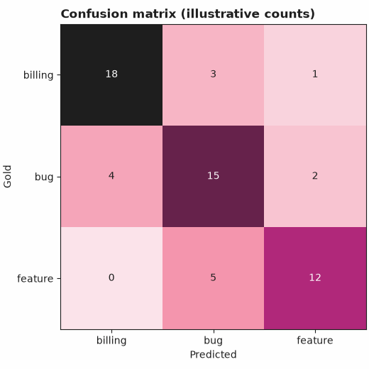
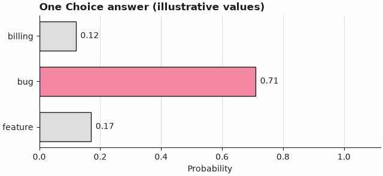
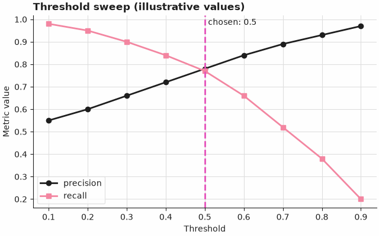
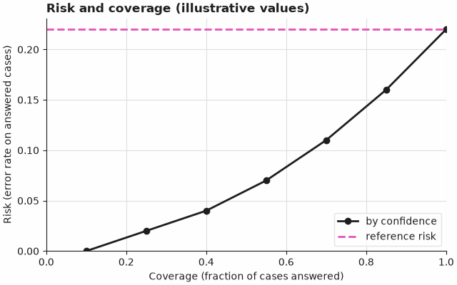

# Notebook style

`jev_cookbook.style` makes every notebook look the same and makes every notebook say which
mode it ran in. It is one module, `src/jev_cookbook/style.py`, with no data files: the
theme is a dict of matplotlib settings in code, so there is nothing extra to package.

```python
from jev_cookbook.style import apply_style, run_header, show_answer

apply_style()  # once, near the top
run_header(7, "Triage support tickets", "synthetic")
show_answer(answer)  # the typed answer, before any aggregate
```

Importing the module changes nothing global (no rcParams, no colormap registration, no
pyplot import). `apply_style()` does that on purpose. The chart helpers apply the theme
themselves, so they look right even if `apply_style()` was not called.

## Run header

`run_header(recipe, title, mode, *, model=None, recorded_on=None)` prints three lines and
returns the same text. `mode` is `"synthetic"`, `"scripted"`, `"recorded"`, `"live"`, or a
`RunInfo(mode, model, recorded_on)`. Recorded needs `model` and `recorded_on`, live needs
`model`; a synthetic or scripted run refuses a model, because nothing a model produced is
in it. Wrong combinations raise `ValueError` rather than printing a vague header.

Synthetic (offline replay of `synthetic` fixtures):

```text
Recipe 07: Triage tickets
Mode: offline replay of synthetic fixtures
Metrics in this run are checks that the pipeline works. They are not Jev results.
```

Scripted backend (offline): same third line, second line `Mode: offline, scripted backend`.

Recorded (offline replay of `recorded` fixtures; the model string and date are the ones you pass):

```text
Recipe 07: Triage tickets
Mode: offline replay of recorded fixtures
The answers were captured from a real Jev call to model MODEL on DATE. Any numbers below describe only that recorded sample.
```

Live:

```text
Recipe 07: Triage tickets
Mode: live
Calls are being made now to model MODEL.
```

The header never states or implies quality, latency, or cost, in any mode. Tests pin the
exact text of every mode and check that the synthetic sentence appears in synthetic and
scripted runs and in no other.

## One typed answer

`show_answer(answer)` prints, and `format_answer(answer)` returns, a readable view. Answers
are read by duck typing: a Choice has `choice`, `probabilities`, `confidence`; a Score has
`score`, `probabilities`, `confidence`, `legend`; a Noul has `noul` only (the probability
of yes, with no separate confidence); every answer has a `provenance`.

```text
Choice: calm (confidence 0.90)
  calm     0.70  ##############
  angry    0.20  ####
  excited  0.10  ##
Provenance: synthetic
```

## Charts

All helpers take plain arrays or mappings, return a matplotlib `Figure` (the one that owns
`ax` when you pass `ax=`), never call `plt.show()`, and work on the `Agg` backend. The
figures are not registered with pyplot, so a notebook does not show them twice: end the
cell with the returned figure, or call `fig.savefig(...)`.

| Helper | Draws |
| --- | --- |
| `plot_confusion_matrix(counts, labels, *, normalize=False, title=None, ax=None)` | gold by predicted, every cell annotated |
| `plot_answer_probabilities(answer, *, highlight=None, title=None, ax=None)` | probability bars for a Choice, Score, Noul, or a plain mapping |
| `plot_threshold_sweep(thresholds, metrics, *, chosen=None, title=None, ax=None)` | one line per metric, chosen threshold marked |
| `plot_risk_coverage(coverage, risk, *, label=None, reference_risk=None, title=None, ax=None)` | error rate on answered cases against fraction answered |

### Legibility on GitHub's light and dark views

Every figure has an explicit, opaque paper (`#FEFEFE`) figure and axes background, and
`savefig.transparent` is off, so a figure keeps its own light panel inside GitHub's dark
notebook view instead of drawing ink-coloured text on a dark page. A test saves every
chart to PNG and checks that no pixel is transparent and the corner pixel is paper.

### Colour-blind readability

- Categorical order: ink `#1E1E1E`, pink `#F386A1`, blue `#1F78A8`, amber `#E8A33D`.
  Blue and amber are additions to the brand palette: pink and magenta alone become nearly
  one hue for protanopia. Magenta `#E551BA` is kept for highlights (the score line, the
  chosen threshold) and is not in the cycle. Lines also differ by marker shape.
- Sequential ramp (confusion matrix): `#FBE3EA`, pink, `#B0287A`, ink, with lightness
  falling at every stop.
- Check actually run (`tests/test_style.py`): the four categorical colours were converted to
  deuteranopia and protanopia with the Machado, Oliveira and Fernandes (2009) matrices
  (severity 1.0, in linear RGB), and every pair was compared by CIELAB distance (dE76). The
  test requires at least 20 for every pair in normal vision and under both simulations; the
  measured minimums are 49.7 (normal), 49.8 (deuteranopia) and 28.9 (protanopia, pink
  against blue). For the ramp, the CIELAB lightness L* of the stops is 92.3, 68.5, 41.5 and
  11.3 (steps of at least 10, required by the test), and the sampled colormap is strictly
  monotonic, so it also reads in greyscale. This is a simulation and a distance check, not a
  study with colour-blind readers.

## Example figures

The images below are regenerated by the snippet that follows. The data is made up for
illustration; it is not model output and says nothing about how Jev performs.






```python
# Regenerates docs/assets/notebook-style/*.png. Run from the repository root.
# The numbers are illustrative placeholders, not results.
from dataclasses import dataclass
from pathlib import Path

from jev_cookbook.style import (
    plot_answer_probabilities,
    plot_confusion_matrix,
    plot_risk_coverage,
    plot_threshold_sweep,
)

OUT = Path("docs/assets/notebook-style")
OUT.mkdir(parents=True, exist_ok=True)


@dataclass
class IllustrativeChoice:  # stand-in with the attribute names of a Choice answer
    choice: str
    probabilities: dict
    confidence: float
    provenance: str = "synthetic"


def save(fig, name):
    # No "Software" metadata, so the PNG bytes do not change with the matplotlib version tag.
    fig.savefig(OUT / name, metadata={"Software": None})


save(
    plot_confusion_matrix(
        [[18, 3, 1], [4, 15, 2], [0, 5, 12]],
        ["billing", "bug", "feature"],
        title="Confusion matrix (illustrative counts)",
    ),
    "confusion-matrix.png",
)
save(
    plot_answer_probabilities(
        IllustrativeChoice("bug", {"billing": 0.12, "bug": 0.71, "feature": 0.17}, 0.71),
        title="One Choice answer (illustrative values)",
    ),
    "answer-probabilities.png",
)
thresholds = [0.1, 0.2, 0.3, 0.4, 0.5, 0.6, 0.7, 0.8, 0.9]
save(
    plot_threshold_sweep(
        thresholds,
        {
            "precision": [0.55, 0.6, 0.66, 0.72, 0.78, 0.84, 0.89, 0.93, 0.97],
            "recall": [0.98, 0.95, 0.9, 0.84, 0.77, 0.66, 0.52, 0.38, 0.2],
        },
        chosen=0.5,
        title="Threshold sweep (illustrative values)",
    ),
    "threshold-sweep.png",
)
save(
    plot_risk_coverage(
        [0.1, 0.25, 0.4, 0.55, 0.7, 0.85, 1.0],
        [0.0, 0.02, 0.04, 0.07, 0.11, 0.16, 0.22],
        label="by confidence",
        reference_risk=0.22,
        title="Risk and coverage (illustrative values)",
    ),
    "risk-coverage.png",
)
```
